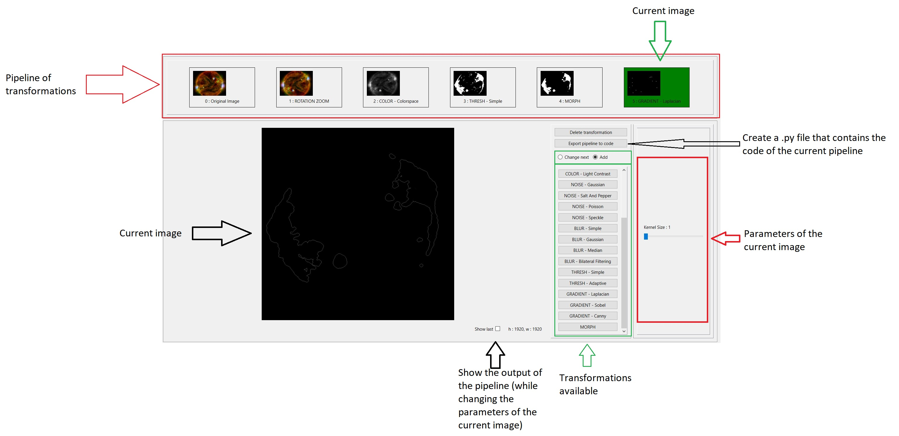

# OpenCV-GUI [](https://github.com/ArthurDelannoyazerty/OpenCV-GUI/releases)
A graphical interface for the OpenCV functions and more. This let you create an interactive pipeline of transformation for the selected image. 

Do you want to rapidly apply transformations to an image ? This program is made for that ! 

You can test in all functions given by OpenCV and more with an instant refresh of the result image. All the parameters of each transformations can be easily and rapidly changed with user friendly UI. You can even change previous transformations while observing the change for the result image !

**You can export the pipeline of transformation to python code or download the selected image by just pressing a button !**

# Getting started
Just download the latest release and execute the *.exe* file. Make sure that the *commands.txt* file is in the same directory as the *.exe* file.

### Create the environment : 
```
conda env create -f environment/environment.yml
```
(default name = "opencv-gui-env")

# GUI explanation



# A detail
If you want to use some functions that only apply to 1 channel image like Canny, Threshold, Gradient, Morph... You need to transform your RGB image to a 1 channel image using "COLOR - Colorspace (grayscale)" or "COLOR - Channel".

# Want to help the project ?
You can clone or fork the repo as you wish. The pulls request still need the approval of the admin for security.

# Questions/Issue ?
Don't hesitate to ask in the github page of this project.

# Command file
The command file located in the same directory as the *.exe* file contains all the functions that transform the image. 

This file is made to be modified by the user if needed. There is a particular structure that needs to be followed. 

This file contains a series of nested python dictionnary that provide information about how the image is transformed, with which parameters and at what condition. Because of the nature of Python dictionnaries, each name must be differents from another in the same level of dictionnaries

Here is the structure :

```python
{
    (string)'Name-of-the-transformation': {
        'command': (string)'Command-to-transform-"image"(using "cv" or "np")',
        'number_parameters': (int)number-of-parameters("image" included),
        'condition': (boolean)condition-on-image-to-make-the-transformation-appear-in-the-gui,
        'gui': {
            'slider': {
                'number_slider': (int)number-of-parameter-needing-slider,
                'slider0': {
                    'name': (string)'name-of-the-parameters(user)',
                    'variable_name': (string)'name-of-the-parameters(to put in the "command")',
                    'min_value': (string)'min-value-of-the-slider(condition with "image" possible)',
                    'max_value': (string)'max-value-of-the-slider(condition with "image" possible)',
                    'step': (string)'step-of-the-slider (no tests, working for 1 and 2)',
                    'default_value': (string)'default-value-of-the-slider(condition with "image" possible)'
                },
                'slider1': {
                    'name': (string)'name-of-the-parameters(user)',
                    'variable_name': (string)'name-of-the-parameters(to put in the "command")',
                    'min_value': (string)'min-value-of-the-slider(condition with "image" possible)',
                    'max_value': (string)'max-value-of-the-slider(condition with "image" possible)',
                    'step': (string)'step-of-the-slider (no tests, working for 1 and 2)',
                    'default_value': (string)'default-value-of-the-slider(condition with "image" possible)'
                }
            },
            'menu': {
                'number_menu': (int)number-of-parameter-needing-menu,
                'menu0': {
                    'name': (string)'name-of-the-parameters(user)',
                    'variable_name': 'name-of-the-parameters(to put in the "command")',
                    'menu_item':{
                        (string)'Name-of-the-option(user)': (int)value-of-the-option,
                        (string)'Name-of-the-option(user)': (int)value-of-the-option
                    }
                }
            }
        }
    },
    # Other transformations ...
}
```

And here is an example :

```python
{
    'THRESH - Simple': {
        'command': 'cv.threshold(image, thresh_value, max_value, thresh_type)',
        'number_parameters' : 4,            # 4 parameters : 1 image, 2 sliders, 1 menu 
        'condition': 'len(image.shape)==2', # Image in 1 dimension
        'gui':{
            'slider':{
                'number_slider': 2,
                'slider0': {
                    'name': 'Thresh Value',             # visual name
                    'variable_name': 'thresh_value',    # name used in 'command'
                    'min_value': '0',
                    'max_value': '255',
                    'step':'1',
                    'default_value': '128'
                },
                'slider1': {
                    'name': 'Max Value',
                    'variable_name': 'max_value',
                    'min_value': '0',
                    'max_value': '255',
                    'step':'1',
                    'default_value': '255'
                }
            },
            'menu':{
                'number_menu': 1,
                'menu0': {
                    'name': 'Threshold Type',
                    'variable_name': 'thresh_type',
                    'menu_item':{
                        'Binary' : cv.THRESH_BINARY,
                        'Binary Inverted': cv.THRESH_BINARY_INV,
                        'Truncate': cv.THRESH_TRUNC,
                        'To Zero': cv.THRESH_TOZERO,
                        'To Zero Inverted': cv.THRESH_TOZERO_INV,
                        'Otsu': cv.THRESH_OTSU
                    }
                }
            }
        }
    }, ...# Other transformations ...
}
```
